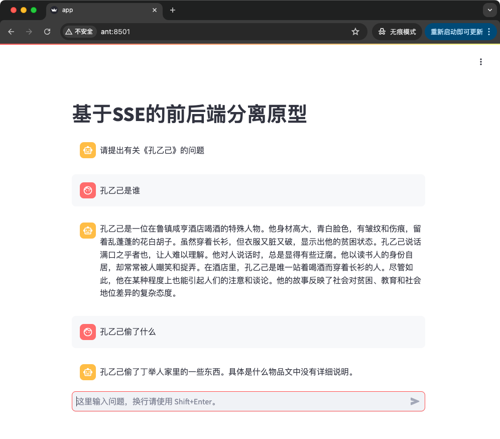

# 基于sse的前后端分离原型

实现了：

- 技术栈： one-api>llamaindex>fastapi>streamlit
- 基于sse的流式输出
- 前后端分离
    - fastapi作为后端
    - strreamlit作为前端  
    




## 实现的迭代过程

- m0, `m0-mock`, 在服务器端模拟了流式输出，curl作为客户端
- m1, `m1-sync`, 服务器端实现了最简单的基于llm的流式输出，curl作为客户端
- m2, `m2-streaming`, 实现了最基本的流式输出，包括服务器端和客户端
- m3, `m3-llamaindex-curl`, 实现llamaindex+fastapi的流式输出，并通过curl测试
- m4, `m4-llamaindex-streamlit`, 实现llamaindex+fastapi+streamlit，实现基本的聊天功能

## 实现效果展示

### m2


### m3

```bash
curl -N -X POST  \
 -H "Content-Type: application/json" \
 -H "accept: text/event-stream" \
 -d '{"query":"回字有几种写法？\n"}' \
 http://127.0.0.1:7777/query
```


### m4

